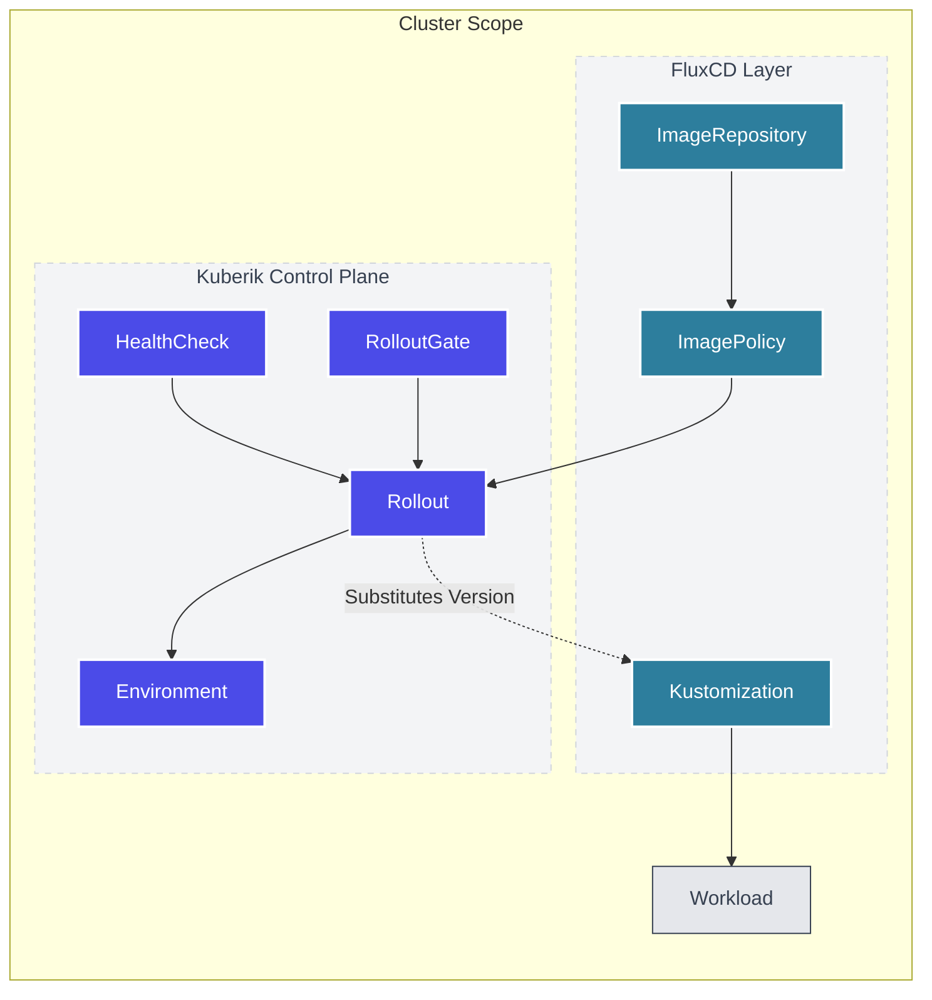

Kuberik is a GitOps-native orchestration layer that extends the standard controller pattern to handle complex deployment lifecycles.

## System Overview

## Component Roles

| Component | Purpose |
|-----------|---------|
| **Rollout** | The core state machine. Watches `ImagePolicy` and orchestrates releases. |
| **Environment** | Maps a Rollout to a logical target (e.g. "production") and syncs status to external backends (GitHub). |
| **HealthCheck** | Probes system health during the bake period (HTTP, Datadog, Script). |
| **RolloutGate** | Blocks a Rollout from proceeding until specific conditions (manual approval, API check) are met. |

## The Release Lifecycle

{}

### Discovery

Flux detects a new image tag. Kuberik creates a pending `Release`.

### Gating

`RolloutGates` are evaluated. If any gate fails or is pending, the release waits.

### Execution

Kuberik updates the `Kustomization` variables. Flux applies the changes.

### Bake Time

Kuberik waits for a defined stabilization period.

### Verification

`HealthChecks` run continuously.

-  All health checks pass — release is promoted.
-  A health check fails — release is halted.

{}
