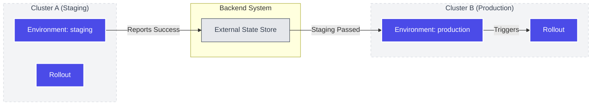

An **Environment** connects a Rollout to an external deployment backend and enables multi-cluster coordination.

## What is an Environment?

Environments represent deployment targets like `staging`, `production`, or `eu-west-1`. They:

1. Link to a **Rollout** to track its versions
2. Sync state to an external **backend** for coordination
3. Define **relationships** for cross-environment promotion

## Environment Resource

```yaml {filename="environment.yaml"}
apiVersion: environments.kuberik.com/v1alpha1
kind: Environment
metadata:
  name: production
  namespace: default
spec:
  # The Rollout this environment tracks
  rolloutRef:
    name: my-app

  # Human-readable environment name
  name: "production"

  # External backend for state coordination
  backend:
    type: github
    project: "my-org/my-repo"
    secret: "github-token"

  # (Optional) Wait for upstream environment
  relationship:
    environment: staging
    type: After
```

## Key Fields

| Field | Purpose |
|-------|---------|
| `rolloutRef` | Reference to the Rollout resource |
| `name` | Human-readable environment name for dashboards |
| `backend` | External state store (GitHub is the first supported backend) |
| `relationship` | Dependency on another environment's success |

## Multi-Cluster Coordination

Kuberik uses external backends as a coordination layer. With the **GitHub** backend, this enables:

- **Disconnected clusters**: Staging in AWS, Production in GCP—no direct networking required
- **Audit trail**: Full deployment history visible in GitHub
- **Status checks**: Branch protections can require successful deployments

During deployment:
1. Environment controller updates the backend
2. State is recorded (Pending → Success/Failure)
3. Downstream environments watch for success events



## Environment Relationships

Define promotion chains with the `relationship` field:

```yaml
spec:
  relationship:
    environment: staging  # Wait for this environment
    type: After           # Only proceed after it succeeds
```

This creates automatic promotion: when `staging` succeeds with version `v1.2.0`, `production` becomes eligible to deploy `v1.2.0`.

## Backend Configuration

Environments require a backend to store deployment state. The backend type is specified in `spec.backend.type`.

### GitHub

```yaml
spec:
  backend:
    type: github
    project: "owner/repo"
    secret: "github-credentials"  # Secret containing token
```

The secret must contain a GitHub token with `deployments` write scope (`repo:deployment`). See [GitHub Integration](/docs/integrations/github/) for setup details.

## Viewing Deployments

Since Kuberik syncs state to external backends, you can view deployment history in your backend provider's UI.

For GitHub:
1. Navigate to your repository
2. Click **Environments** in the sidebar
3. View deployment history and status

## Related Guides

- [Cross-Environment Rollout](/docs/guides/cross-environment-rollout/) — Set up staging → production
- [GitHub Integration](/docs/integrations/github/) — Configure the GitHub backend
