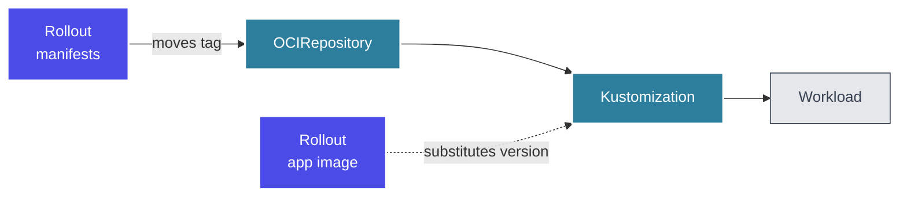

A Rollout decides **which version** is allowed to run in an environment. What that version points at is your choice: the **image tag** of your application, or the **rendered manifests** for that environment. Kuberik supports both, and the difference is one annotation.

| | Image tag | Rendered manifests |
|---|---|---|
| Kuberik watches | An `ImagePolicy` over your app image | An `ImagePolicy` over your manifest artifact |
| Kuberik writes | `postBuild.substitute` on a `Kustomization` | `spec.ref.tag` on an `OCIRepository` |
| Annotation | `rollout.kuberik.com/substitute.<VAR>.from` | `rollout.kuberik.com/rollout` |
| Flux source | `GitRepository` | `OCIRepository` |
| A release changes | One variable | Everything in the artifact |

Everything above this layer is identical. Gates, health checks, bake time, rollback, and cross-environment promotion behave the same way regardless of which mode you pick.

## Image Tag

Your manifests live in git. Kuberik selects a version and writes it into the Kustomization's substitution variables; Flux renders the overlay and applies it.

```yaml {filename="kustomization.yaml"}
apiVersion: kustomize.toolkit.fluxcd.io/v1
kind: Kustomization
metadata:
  name: my-app
  namespace: my-app
  annotations:
    rollout.kuberik.com/substitute.APP_VERSION.from: "my-app"
spec:
  path: ./k8s/overlays/production
  sourceRef:
    kind: GitRepository
    name: my-app
  postBuild:
    substitute:
      APP_VERSION: "1.0.0"  # Default, overwritten by Kuberik
```

A rollout in this mode changes exactly one thing: the image tag. Config changes reach the cluster through a separate path, whenever the Kustomization next reconciles git. That makes rollouts narrow and fast to reason about, and it means a rollback restores the image, not the configuration that shipped with it.

Reach for this when your deployments are a single service whose changes are almost always "new build of the same code", and when you want the smallest possible setup.


**One Kustomization, several Rollouts**

Declare one annotation per substitution variable. A frontend and a backend managed by independent Rollouts can drive the same Kustomization.


## Rendered Manifests

Your CI renders the manifests for an environment (`kustomize build`, `helm template`, `cdk8s synth`, whatever you already run) and pushes the result as an OCI artifact to a path scoped to that environment. Kuberik owns the tag on the matching `OCIRepository`.

```yaml {filename="ocirepository.yaml"}
apiVersion: source.toolkit.fluxcd.io/v1
kind: OCIRepository
metadata:
  name: my-app
  namespace: my-app
  annotations:
    rollout.kuberik.com/rollout: "my-app"
spec:
  interval: 60s
  url: oci://ghcr.io/my-org/my-app/production/manifests
```

```yaml {filename="kustomization.yaml"}
apiVersion: kustomize.toolkit.fluxcd.io/v1
kind: Kustomization
metadata:
  name: my-app
  namespace: my-app
spec:
  prune: true
  sourceRef:
    kind: OCIRepository
    name: my-app
```

A release in this mode is a tag bump on one `OCIRepository`. A promotion is the same tag bump on the next environment's `OCIRepository`. A rollback in production moves that one tag back, and staging is not dragged along with it. Because the artifact carries the whole desired state, a config change is a release: it goes through the same gates, the same bake time, and the same automatic rollback as a code change.

This does not replace committing rendered manifests to git. Render once, ship twice: the commit is what humans review in a pull request, the artifact is what the cluster pulls. Same bytes, two destinations.

Reach for this when config changes are as risky as code changes, when you want promotion to move a byte-identical artifact between environments, or when the cluster should not need source access or build tooling to produce its own desired state.


**Same namespace**

Kuberik resolves the `ImagePolicy`, `Kustomization`, and `OCIRepository` in the Rollout's own namespace. Resources in other namespaces are ignored.


## Running Both

The two modes are not exclusive. A common setup gives one service two Rollouts: one over the manifest artifact, one over the application image.



The manifests Rollout gates changes to the deployment shape. The app Rollout gates changes to the running code. Each gets its own schedule, its own approvals, and its own rollback behavior, which lets you auto-deploy code all day while holding infrastructure changes for a maintenance window.

## Related

- [Getting Started](/docs/getting-started/) sets up either mode step by step
- [FluxCD Integration](/docs/integrations/fluxcd/) covers the Flux resources in detail
- [Publishing Releases](/docs/guides/publishing-releases/) shows the CI side
- [Annotations Reference](/docs/reference/annotations/) lists every annotation
