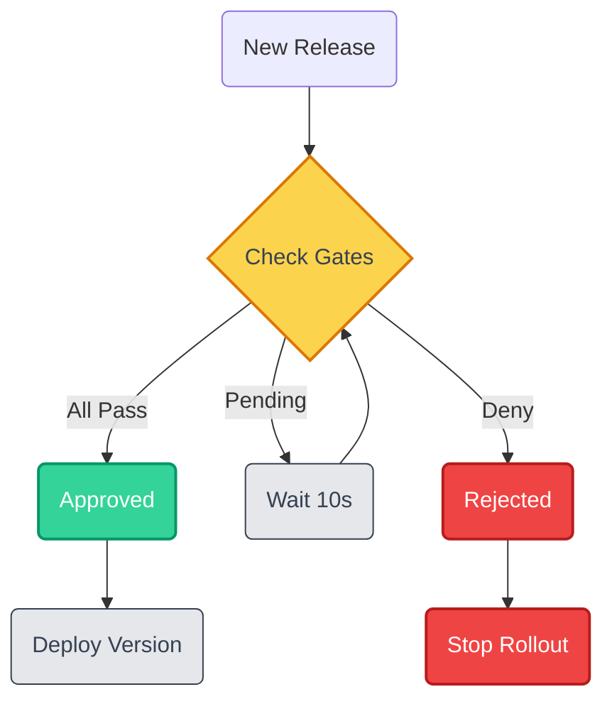
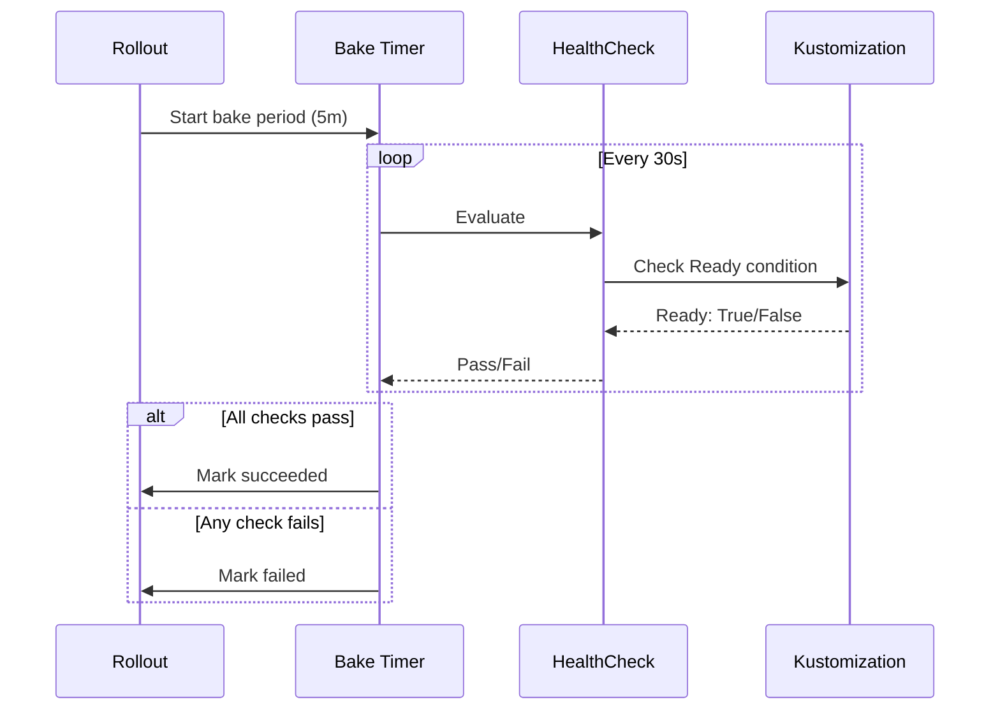

A **Rollout** is the central resource in Kuberik. It tracks container image versions and orchestrates their deployment through a controlled lifecycle.

## What is a Rollout?

A Rollout watches a FluxCD `ImagePolicy` for new container image tags. When a new version is detected, the Rollout:

{}

### Creates a Release Candidate
The new version becomes a pending release waiting for evaluation.

### Evaluates Gates
All [gating conditions](#gating-process) must pass before deployment begins.

### Updates Deployment
Updates the deployment via Flux **Kustomization substitution**.

### Monitors Health
Continuously [monitors health checks](#verification-cycle) during the bake period.

### Marks Status
The version is marked as succeeded or failed based on health results.

{}

## Rollout Resource

```yaml {filename="rollout-structure.yaml"}
apiVersion: kuberik.com/v1alpha1
kind: Rollout
metadata:
  name: my-app
  namespace: default
spec:
  # Watch this ImagePolicy for new versions
  releasesImagePolicy:
    name: my-app

  # How many versions to keep in history
  versionHistoryLimit: 5

  # Stabilization period after deployment
  bakeTime: 15m

  # Select which HealthChecks to evaluate
  healthCheckSelector:
    selector:
      matchLabels:
        app: my-app
```

## Key Fields

| Field | Purpose |
|-------|---------|
| `releasesImagePolicy` | Reference to the FluxCD ImagePolicy that provides new versions |
| `versionHistoryLimit` | How many past versions to retain in status |
| `bakeTime` | Duration to wait and verify health after deployment (e.g., `5m`, `1h`) |
| `healthCheckSelector` | Label selector to find HealthCheck resources to evaluate |

## Rollout Status

The Rollout's status shows the current state:

```bash
kubectl get rollout my-app -o yaml
```

Key status fields:
- `currentVersion` — The actively deployed version
- `pendingVersion` — A version waiting for gates to pass
- `history` — Timeline of past deployments with outcomes

## Gating Process

Before a rollout begins, it must pass all defined gates. This flow ensures human or automated approvals:




**Healthy Environment Required**

A rollout will not start if existing health checks are failing. The release waits until the environment recovers. New deployments never land on top of an active incident.


## Verification Cycle

During the **bake time**, Kuberik continuously verifies health:



## Sequential Processing


**One Version at a Time**

Kuberik processes **one version at a time**. If version `v1.2.0` is baking and `v1.3.0` is detected:

1. `v1.3.0` becomes a pending release
2. It waits until `v1.2.0` completes (success or failure)
3. Then `v1.3.0` begins its own lifecycle

This prevents deployment storms and ensures each version gets proper verification.


## Manual Deployments

Deploy a specific version manually during an incident or for targeted recovery. Kuberik distinguishes these from automated rollouts.


**Manual Deploys Are Not Auto-Reverted**

Kuberik does not automatically roll back a manually initiated deployment. An operator deploying by hand has made a deliberate decision — the controller does not override it.



**Rollback Suppressed in Unhealthy Environments**

When a manual rollout lands in an already unhealthy environment, automatic rollback is disabled for that release. This avoids a feedback loop where a rollback triggers further instability, compounding the incident.


## Related Guides

- [Getting Started](/docs/getting-started/) — Set up your first Rollout
- [Health Checks](/docs/guides/health-checks/) — Configure verification
- [Manual Approvals](/docs/guides/manual-approvals/) — Add approval gates
- [Deployment Schedules](/docs/guides/schedules/) — Control deployment time windows
