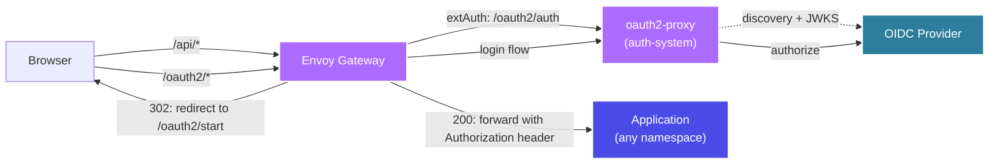

Run a single cluster-level OIDC auth gate that any service can opt into. [oauth2-proxy](https://oauth2-proxy.github.io/oauth2-proxy/) lives in its own `auth-system` namespace as shared infrastructure — it never sees upstream backends. Each application namespace attaches a small `SecurityPolicy` to its own `HTTPRoute`, and [Envoy Gateway](https://gateway.envoyproxy.io)'s extAuth does the rest.

The Rollout Dashboard ships with one such `SecurityPolicy`. Other services in the cluster install the same way — no per-app oauth2-proxy, no copy-pasted manifests.

## Architecture



oauth2-proxy runs in **auth-only mode** (`--upstream=static://200`): it validates tokens and returns `200` with auth headers, or `302` to start the OIDC dance. Envoy's `SecurityPolicy.extAuth` enforces it on every request.

## Register the OIDC Client

Create **one** OAuth2 client at your provider — not per-app, but per-cluster:

- **Client ID**: `kuberik-cluster` (or anything cluster-scoped you like). The same id is reused by kube-apiserver, so the id_token authenticates against both verifiers without any cross-audience trickery.
- **Redirect URI**: `https://<canonical-host>/oauth2/callback` — pick one host that owns the callback; the session cookie applies to all subdomains under `--cookie-domain`
- **Scopes**: `openid email profile groups`

Store the client secret and a fresh cookie secret in `auth-system`:

```bash
kubectl create namespace auth-system
kubectl create secret generic oauth2-proxy-secrets \
  --namespace auth-system \
  --from-literal=client-secret="<client-secret>" \
  --from-literal=cookie-secret="$(openssl rand -base64 32 | tr -- '+/' '-_' | head -c 32)"
```

## Deploy the Auth Gate

```yaml {filename="auth-system.yaml"}
apiVersion: apps/v1
kind: Deployment
metadata:
  name: oauth2-proxy
  namespace: auth-system
spec:
  replicas: 1
  selector:
    matchLabels:
      app: oauth2-proxy
  template:
    metadata:
      labels:
        app: oauth2-proxy
    spec:
      containers:
        - name: oauth2-proxy
          image: quay.io/oauth2-proxy/oauth2-proxy:v7.7.1
          args:
            - --provider=oidc
            - --oidc-issuer-url=https://<your-oidc-issuer>
            - --client-id=kuberik-cluster
            - --email-domain=*
            - --upstream=static://200
            - --http-address=0.0.0.0:4180
            - --redirect-url=https://<canonical-host>/oauth2/callback
            - --scope=openid email profile groups
            - --set-authorization-header=true
            - --pass-access-token=true
            - --set-xauthrequest=true
            - --skip-provider-button=true
            - --cookie-secure=true
            - --cookie-samesite=lax
            - --cookie-domain=.example.com
            - --whitelist-domain=.example.com
            - --reverse-proxy=true
            # Accept JWT bearer tokens signed by the configured issuer without
            # a session cookie. Required for multi-cluster hub→spoke fan-out
            # and any programmatic caller that already holds an id_token.
            - --skip-jwt-bearer-tokens=true
          env:
            - name: OAUTH2_PROXY_CLIENT_SECRET
              valueFrom:
                secretKeyRef: { name: oauth2-proxy-secrets, key: client-secret }
            - name: OAUTH2_PROXY_COOKIE_SECRET
              valueFrom:
                secretKeyRef: { name: oauth2-proxy-secrets, key: cookie-secret }
          ports:
            - containerPort: 4180
---
apiVersion: v1
kind: Service
metadata:
  name: oauth2-proxy
  namespace: auth-system
spec:
  selector:
    app: oauth2-proxy
  ports:
    - port: 4180
      targetPort: 4180
---
# /oauth2/* serves on every gateway hostname (no hostnames filter) so the 302
# redirect from extAuth lands on the right subdomain regardless of which app
# triggered it.
apiVersion: gateway.networking.k8s.io/v1
kind: HTTPRoute
metadata:
  name: oauth2-proxy
  namespace: auth-system
spec:
  parentRefs:
    - name: <gateway-name>
      namespace: <gateway-namespace>
  rules:
    - matches:
        - path:
            type: PathPrefix
            value: /oauth2
      backendRefs:
        - name: oauth2-proxy
          port: 4180
---
# Lets SecurityPolicies in any namespace reference auth-system/oauth2-proxy
# as their extAuth backend without copying any manifests.
apiVersion: gateway.networking.k8s.io/v1beta1
kind: ReferenceGrant
metadata:
  name: oauth2-proxy-from-all
  namespace: auth-system
spec:
  from:
    - group: gateway.envoyproxy.io
      kind: SecurityPolicy
      namespace: ""  # any namespace; pin to a list for tighter scoping
  to:
    - group: ""
      kind: Service
      name: oauth2-proxy
```


If your OIDC provider uses a self-signed certificate, mount its CA as a ConfigMap and pass `--provider-ca-file=/etc/ssl/oidc/ca.crt`.


## Gate an Application

Each application namespace attaches its own `SecurityPolicy` to its `HTTPRoute`. The backend reference crosses into `auth-system` via the `ReferenceGrant`:

```yaml {filename="dashboard-auth.yaml"}
apiVersion: gateway.envoyproxy.io/v1alpha1
kind: SecurityPolicy
metadata:
  name: rollout-dashboard-auth
  namespace: kuberik-system
spec:
  targetRefs:
    - group: gateway.networking.k8s.io
      kind: HTTPRoute
      name: rollout-dashboard
  extAuth:
    http:
      backendRefs:
        - name: oauth2-proxy
          namespace: auth-system
          port: 4180
      headersToBackend:
        - Authorization
        - X-Auth-Request-User
        - X-Auth-Request-Email
        - X-Auth-Request-Access-Token
```

That's the entire per-app integration. `headersToBackend` copies oauth2-proxy's response headers onto the upstream request — the dashboard reads `Authorization: Bearer <id_token>` and uses it as the Kubernetes API server credential. Every action runs as the logged-in user, subject to RBAC.

## Make the Token Work as a Kubernetes Credential

For "every action runs as the logged-in user" to hold, the id_token has to be acceptable to two verifiers: oauth2-proxy **and** the Kubernetes API server. The simplest way — and the only way that works against providers like Okta, Auth0, or Google that don't expose Dex-style cross-client trust — is to point both verifiers at the same audience.

Configure kube-apiserver to trust the same issuer and the same client id you gave oauth2-proxy:

```text {filename="kube-apiserver flags"}
--oidc-issuer-url=https://<your-oidc-issuer>
--oidc-client-id=kuberik-cluster
--oidc-username-claim=email
```

The id_token has `aud: "kuberik-cluster"`. oauth2-proxy accepts it because it matches `--client-id`; kube-apiserver accepts it because it matches `--oidc-client-id`. RBAC binds on the email claim. One token, one audience, two verifiers — no provider-specific tricks.

## Why Bearer Tokens Bypass the Cookie Check

`--skip-jwt-bearer-tokens=true` makes oauth2-proxy accept any request carrying `Authorization: Bearer <jwt>` if the JWT is signed by the configured `--oidc-issuer-url` and its audience includes `--client-id`.

Required for:

- **Multi-cluster fan-out.** The hub dashboard forwards the user's id_token to every spoke. Spoke session cookies don't exist — the hub never logged in there — so bearer-token passthrough is the only path that works.
- **Programmatic clients.** CI jobs and scripts that already hold an id_token call the API directly without driving a browser.

Trade-off: any JWT signed by the same issuer with the right audience grants access. JWTs are short-lived (typically an hour) and the audience pins them to this client, so the blast radius of a leaked token is small. Turn it off only if you need to forbid all non-browser callers — multi-cluster will stop working.

## Wire Up Multi-Cluster

The hub dashboard fans out to every spoke for cross-cluster reads and proxies mutations. Spokes never serve a browser directly — they only see hub-issued requests carrying the user's id_token.

Each cluster runs its **own** auth gate in `auth-system`, pointed at the same OIDC issuer:

| | Hub | Spoke |
|---|---|---|
| Canonical host | `hub.example.com` | `spoke.example.com` |
| oauth2-proxy | `auth-system/oauth2-proxy` | `auth-system/oauth2-proxy` |
| `--redirect-url` | `https://hub.example.com/oauth2/callback` | `https://spoke.example.com/oauth2/callback` |
| `--oidc-issuer-url` | same issuer for both | same issuer for both |
| `--skip-jwt-bearer-tokens` | `true` | `true` |

Register both callback URIs on the same OIDC client.

The hub forwards `Authorization: Bearer <id_token>` to the spoke on every fan-out call. Both oauth2-proxy instances trust the same issuer, so the spoke verifies the token against the shared JWKS and lets the request through. The hub's session cookie never needs to reach the spoke.


If you want users to browse spokes directly with the hub's session, the cluster topology changes — you'd need a shared cookie domain across hosts and cross-cluster routing for `/oauth2/*`. That's a separate setup from hub→spoke fan-out and not what the dashboard ships with.

