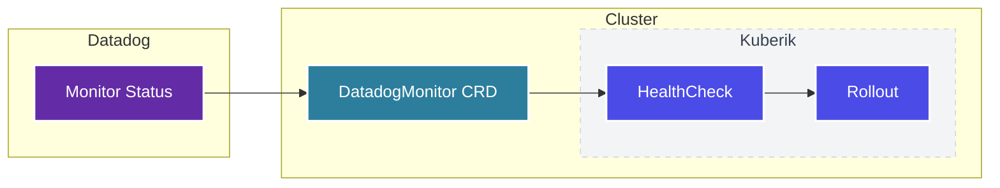

Use Datadog monitors as health check sources for your rollouts.

## Overview

Kuberik can verify deployments by checking **DatadogMonitor** resource status:



If a Datadog monitor is alerting during bake time, the rollout is marked failed.

---


## Setup

### Create DatadogMonitor

Define a monitor that checks your application health:

```yaml {filename="datadog-monitor.yaml"}
apiVersion: datadoghq.com/v1alpha1
kind: DatadogMonitor
metadata:
  name: my-app-error-rate
  namespace: default
  annotations:
    # Enable as Kuberik health check
    kuberik.com/health-check: "true"
  labels:
    # Used by Rollout to select this check
    app: my-app
spec:
  name: "My App Error Rate"
  type: metric alert
  query: "avg(last_5m):sum:my_app.errors{env:production} > 10"
  message: "Error rate too high"
  tags:
    - "env:production"
    - "team:platform"
```

Apply it:
```bash
kubectl apply -f datadog-monitor.yaml
```

### Connect to Rollout

Configure your Rollout to select Datadog monitors:

```yaml {filename="rollout.yaml"}
apiVersion: kuberik.com/v1alpha1
kind: Rollout
metadata:
  name: my-app
spec:
  releasesImagePolicy:
    name: my-app
  versionHistoryLimit: 5
  bakeTime: 10m

  # Select monitors with matching labels
  healthCheckSelector:
    selector:
      matchLabels:
        app: my-app
```

---

## How It Works

During bake time:

1. Kuberik finds DatadogMonitors with `kuberik.com/health-check: "true"`
2. Filters by `healthCheckSelector` labels
3. Checks each monitor's status
4. If any monitor is in `Alert` state → rollout fails
5. If all monitors are `OK` → rollout proceeds

---

## Monitor Types

Kuberik supports all Datadog monitor types:

| Type | Use Case |
|------|----------|
| `metric alert` | Error rates, latency thresholds |
| `service check` | Service availability |
| `event alert` | Error log patterns |
| `process alert` | Process health |

### Example: Latency Monitor

```yaml {filename="error-rate-monitor.yaml"}
spec:
  name: "P99 Latency"
  type: metric alert
  query: "avg(last_5m):percentile(my_app.request.latency{env:production}, 0.99) > 500"
  message: "P99 latency exceeds 500ms"
```

### Example: Error Rate Monitor

```yaml
spec:
  name: "Error Rate"
  type: metric alert
  query: "sum(last_5m):sum:my_app.errors{env:production} / sum:my_app.requests{env:production} > 0.01"
  message: "Error rate exceeds 1%"
```

---

## Best Practices

### Use Bake-Specific Monitors

Create monitors specifically for deployment verification:

```yaml
metadata:
  name: my-app-deploy-check
  annotations:
    kuberik.com/health-check: "true"
spec:
  query: "avg(last_2m):avg:my_app.startup.success{version:${version}} < 0.99"
```

### Appropriate Thresholds

- Set thresholds that catch real issues
- Avoid flaky monitors that alert randomly
- Use `last_5m` or longer for stability

### Separate Labels

Use distinct labels for deployment checks vs. alerting:

```yaml
labels:
  app: my-app
  purpose: deployment-gate  # Only select these for rollouts
```

---

## Troubleshooting

### Monitor not being checked

1. Verify annotation is present:
   ```bash
   kubectl get datadogmonitor my-app-monitor -o yaml
   ```

2. Check labels match Rollout selector:
   ```bash
   kubectl describe rollout my-app
   ```

### False positives

If monitors are too sensitive:
- Increase evaluation window (`last_5m` → `last_10m`)
- Adjust thresholds
- Add `no data` handling

---

## Next Steps


  
  

