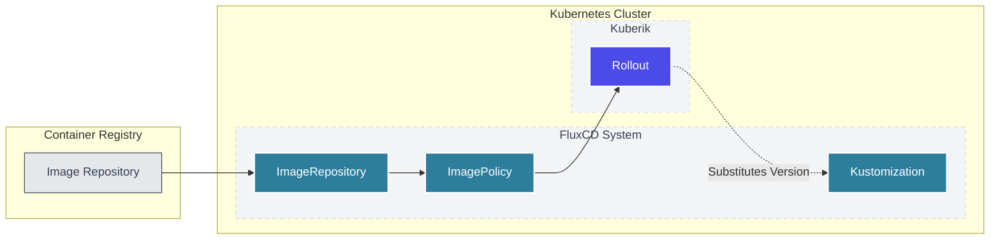

Kuberik uses FluxCD for image automation and GitOps deployments.

## Overview

FluxCD provides two critical capabilities for Kuberik:

| Component | Purpose |
|-----------|---------|
| **ImageRepository** + **ImagePolicy** | Detects new container image versions |
| **Kustomization** | Applies versioned manifests to the cluster |



---


## Image Automation Setup

### Create ImageRepository

Tell Flux where to scan for images:

```yaml {filename="image-repo.yaml"}
apiVersion: image.toolkit.fluxcd.io/v1beta2
kind: ImageRepository
metadata:
  name: my-app
  namespace: flux-system
spec:
  image: ghcr.io/my-org/my-app
  interval: 5m
  # For private registries
  secretRef:
    name: registry-credentials
```

### Create ImagePolicy

Define which tags to consider:


  
  **Semantic Versioning (Recommended)**

  ```yaml {filename="image-policy-semver.yaml"}
  apiVersion: image.toolkit.fluxcd.io/v1beta2
  kind: ImagePolicy
  metadata:
    name: my-app
    namespace: flux-system
  spec:
    imageRepositoryRef:
      name: my-app
    policy:
      semver:
        range: ">=1.0.0"
  ```
  

  
  **Alphabetical / Numerical**

  Useful for timestamps or build numbers:

  ```yaml {filename="image-policy-alpha.yaml"}
  apiVersion: image.toolkit.fluxcd.io/v1beta2
  kind: ImagePolicy
  metadata:
    name: my-app
    namespace: flux-system
  spec:
    imageRepositoryRef:
      name: my-app
    policy:
      alphabetical:
        order: desc
  ```
  


### Verify Discovery

Check that Flux found your images:

```bash
kubectl get imagepolicy -n flux-system my-app
```

Expected output shows the latest matching version.

---

## Kustomization Integration

### Version Substitution

Kuberik updates Kustomizations by modifying `postBuild.substitute` values:

```yaml {filename="kustomization.yaml"}
apiVersion: kustomize.toolkit.fluxcd.io/v1
kind: Kustomization
metadata:
  name: my-app
  namespace: flux-system
  annotations:
    # Kuberik reads the version from this Rollout
    rollout.kuberik.com/substitute.APP_VERSION.from: "my-app"
spec:
  interval: 10m
  path: ./k8s/overlays/production
  sourceRef:
    kind: GitRepository
    name: my-app
  postBuild:
    substitute:
      APP_VERSION: "1.0.0"  # Default, overwritten by Kuberik
```

Your manifests use the variable:

```yaml
# deployment.yaml
spec:
  containers:
    - name: app
      image: ghcr.io/my-org/my-app:${APP_VERSION}
```

---

## Health Check Integration

Use Kustomization health status as a deployment gate:

```yaml
apiVersion: kuberik.com/v1alpha1
kind: HealthCheck
metadata:
  name: my-app-health
  annotations:
    healthcheck.kuberik.com/kustomization: "my-app"
spec:
  class: "kustomization"
```

This checks if the Kustomization's `Ready` condition is true.

---

## Troubleshooting

### ImagePolicy not finding versions

1. Check ImageRepository status:
   ```bash
   kubectl describe imagerepository -n flux-system my-app
   ```

2. Verify registry authentication:
   ```bash
   kubectl get secret -n flux-system registry-credentials
   ```

### Kustomization not updating

1. Check Kuberik annotation is present
2. Verify Rollout name matches annotation value
3. Check Rollout status:
   ```bash
   kubectl describe rollout my-app
   ```

---

## Next Steps


  
  

