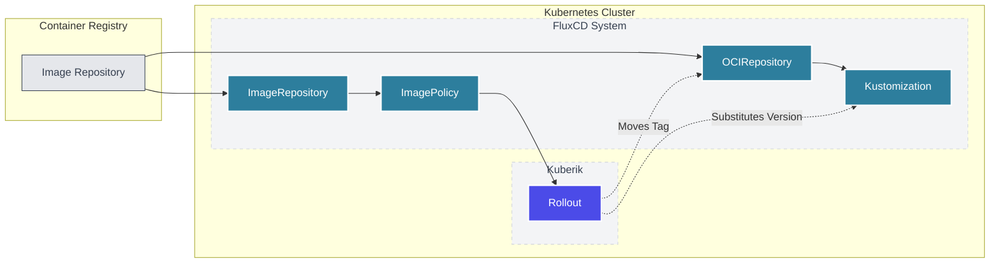

Kuberik uses FluxCD for image automation and GitOps deployments.

## Overview

FluxCD provides two critical capabilities for Kuberik:

| Component | Purpose |
|-----------|---------|
| **ImageRepository** + **ImagePolicy** | Detects new tags on an image or manifest artifact |
| **Kustomization** | Applies versioned manifests to the cluster |
| **OCIRepository** | Pulls rendered manifests published as an OCI artifact |

Kuberik drives one of two of these. Annotate a `Kustomization` and Kuberik substitutes the version into it; annotate an `OCIRepository` and Kuberik moves its tag. See [Propagation Modes](/docs/concepts/propagation/).


**Everything in the Rollout's Namespace**

Kuberik resolves the `ImagePolicy` and lists `Kustomization` and `OCIRepository` resources in the Rollout's own namespace. Resources in `flux-system` are not seen by a Rollout in `my-app`.



```mermaid
flowchart LR
    %% Styles
    classDef flux fill:#2D7E9D,stroke:#fff,stroke-width:2px,color:#fff
    classDef kuberik fill:#4B4BE8,stroke:#fff,stroke-width:2px,color:#fff
    classDef external fill:#E5E7EB,stroke:#374151,stroke-width:1px,color:#374151
    classDef boundary fill:#F3F4F6,stroke:#D1D5DB,stroke-width:1px,color:#374151,stroke-dasharray: 5 5

    subgraph Registry ["Container Registry"]
        REG[Image Repository]:::external
    end

    subgraph Cluster ["Kubernetes Cluster"]
        direction TB

        subgraph FluxCD ["FluxCD System"]
            IR[ImageRepository]:::flux
            IP[ImagePolicy]:::flux
            OCIR[OCIRepository]:::flux
            KS[Kustomization]:::flux
        end

        subgraph Kuberik ["Kuberik"]
            RO[Rollout]:::kuberik
        end
    end

    REG --> IR
    REG --> OCIR
    IR --> IP
    IP --> RO
    OCIR --> KS
    RO -.->|Substitutes Version| KS
    RO -.->|Moves Tag| OCIR

    class FluxCD,Kuberik boundary
```

---


## Image Automation Setup

### Create ImageRepository

Tell Flux where to scan for new tags. Point it at your application image, or at the manifest artifact your CI publishes for this environment:

```yaml {filename="image-repo.yaml"}
apiVersion: image.toolkit.fluxcd.io/v1beta2
kind: ImageRepository
metadata:
  name: my-app
  namespace: my-app
spec:
  image: ghcr.io/my-org/my-app
  interval: 5m
  # For private registries
  secretRef:
    name: registry-credentials
```

### Create ImagePolicy

Define which tags to consider:


  
  **Semantic Versioning (Recommended)**

  ```yaml {filename="image-policy-semver.yaml"}
  apiVersion: image.toolkit.fluxcd.io/v1beta2
  kind: ImagePolicy
  metadata:
    name: my-app
    namespace: my-app
  spec:
    imageRepositoryRef:
      name: my-app
    policy:
      semver:
        range: ">=1.0.0"
  ```
  

  
  **Alphabetical / Numerical**

  Useful for timestamps or build numbers:

  ```yaml {filename="image-policy-alpha.yaml"}
  apiVersion: image.toolkit.fluxcd.io/v1beta2
  kind: ImagePolicy
  metadata:
    name: my-app
    namespace: my-app
  spec:
    imageRepositoryRef:
      name: my-app
    policy:
      alphabetical:
        order: desc
  ```
  


### Verify Discovery

Check that Flux found your images:

```bash
kubectl get imagepolicy -n my-app my-app
```

Expected output shows the latest matching version.

---

## Kustomization Integration

### Version Substitution

Kuberik updates Kustomizations by modifying `postBuild.substitute` values:

```yaml {filename="kustomization.yaml"}
apiVersion: kustomize.toolkit.fluxcd.io/v1
kind: Kustomization
metadata:
  name: my-app
  namespace: my-app
  annotations:
    # Kuberik reads the version from this Rollout
    rollout.kuberik.com/substitute.APP_VERSION.from: "my-app"
spec:
  interval: 10m
  path: ./k8s/overlays/production
  sourceRef:
    kind: GitRepository
    name: my-app
  postBuild:
    substitute:
      APP_VERSION: "1.0.0"  # Default, overwritten by Kuberik
```


**Multiple Rollouts per Kustomization**

A single Kustomization can be driven by multiple Rollouts. Declare one annotation per substitution variable, each pointing to its own Rollout — for example, a frontend and backend version managed by independent rollouts targeting the same Kustomization.



**Repository Structure**

Your Git repository should be organized with Kustomize overlays for different environments:



  
    
      
      
      
    
    
      
        
        
      
      
        
        
      
    
  


Your base deployment uses the substitution variable:

```yaml {filename="k8s/base/deployment.yaml"}
apiVersion: apps/v1
kind: Deployment
metadata:
  name: my-app
spec:
  template:
    spec:
      containers:
        - name: app
          image: ghcr.io/my-org/my-app:${APP_VERSION}
```

---

## OCIRepository Integration

### Tag Management

Kuberik owns `spec.ref.tag` on the annotated OCIRepository. Each environment gets its own artifact path and its own OCIRepository, so a rollback in production moves one tag and leaves every other environment alone.

```yaml {filename="ocirepository.yaml"}
apiVersion: source.toolkit.fluxcd.io/v1
kind: OCIRepository
metadata:
  name: my-app
  namespace: my-app
  annotations:
    # Kuberik reads the version from this Rollout
    rollout.kuberik.com/rollout: "my-app"
spec:
  interval: 60s
  url: oci://ghcr.io/my-org/my-app/production/manifests
  # For private registries
  secretRef:
    name: registry-credentials
```

Point a Kustomization at it and reconcile the artifact directly. No `path`, no substitution, no build tooling in the cluster:

```yaml {filename="kustomization-oci.yaml"}
apiVersion: kustomize.toolkit.fluxcd.io/v1
kind: Kustomization
metadata:
  name: my-app
  namespace: my-app
spec:
  interval: 10m
  prune: true
  sourceRef:
    kind: OCIRepository
    name: my-app
```


**Cosign Verification**

`OCIRepository` supports `spec.verify` natively. The signature is checked before reconciliation, so an unsigned or tampered artifact is rejected before it reaches the API server.


---

## Health Check Integration

Use Kustomization health status as a deployment gate:

```yaml
apiVersion: kuberik.com/v1alpha1
kind: HealthCheck
metadata:
  name: my-app-health
  annotations:
    healthcheck.kuberik.com/kustomization: "my-app"
spec:
  class: "kustomization"
```

This checks if the Kustomization's `Ready` condition is true.

---

{}

### ImagePolicy not finding versions

1. Check ImageRepository status:
   ```bash
   kubectl describe imagerepository -n my-app my-app
   ```

2. Verify registry authentication:
   ```bash
   kubectl get secret -n my-app registry-credentials
   ```

### Kustomization not updating

1. Check Kuberik annotation is present
2. Verify Rollout name matches annotation value
3. Check Rollout status:
   ```bash
   kubectl describe rollout my-app
   ```

### Common Issues


**ImageRepository showing "Failed"**

Usually indicates authentication issues or invalid image path. Check the repository name matches your container registry exactly.



**Kustomization stuck on old version**

Ensure the annotation `rollout.kuberik.com/substitute.VAR_NAME.from` exactly matches your Rollout name.


{}

---

## Next Steps


  
  

